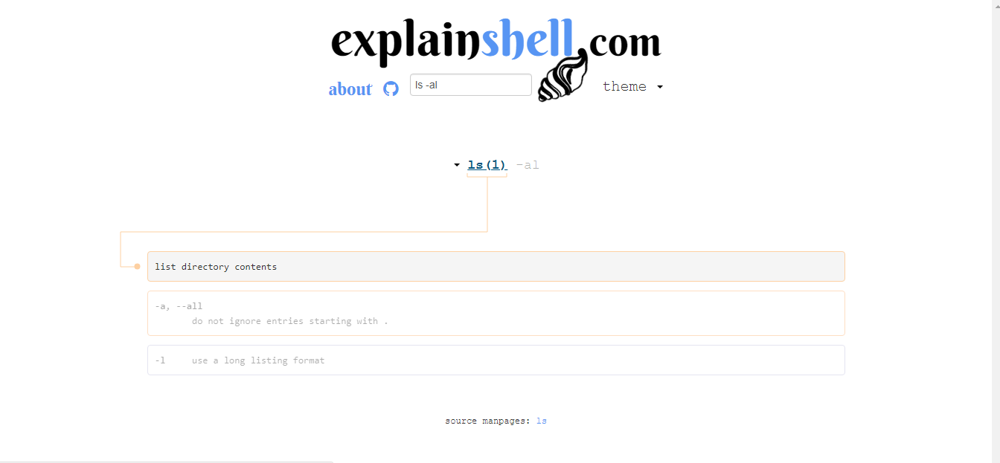

### ls
解释：list directory contents （罗列出ls后目录下所有内容），例如：
``` bash
$ ls
_config.yml  node_modules/  package-lock.json  scaffolds/  themes/
db.json      package.json   public/            source/
```
### cat
解释：concatenate files and print on the standard output（查看某个文件并在标准输出中打印），例如：
``` bash
$ cat package.json
{
  "name": "hexo-site",
  "version": "0.0.0",
  "private": true,
  "hexo": {
    "version": "3.7.1"
  },
  "dependencies": {
    "hexo": "^3.2.0",
    "hexo-deployer-git": "^0.3.1",
    "hexo-generator-archive": "^0.1.4",
    "hexo-generator-category": "^0.1.3",
    "hexo-generator-index": "^0.2.0",
    "hexo-generator-tag": "^0.2.0",
    "hexo-renderer-ejs": "^0.3.0",
    "hexo-renderer-marked": "^0.3.0",
    "hexo-renderer-stylus": "^0.3.1",
    "hexo-server": "^0.2.0"
  }
}
```

### mv
解释：move (rename) files, （移动或重命名文件），例如：
``` bash
$ mv a.txt b.txt
```
### touch
解释：change file timestamps, （新建一个文件或更新一个文件的时间戳）
``` bash
$ touch aaa.txt
```

### 如何使用 [explainshell.com](https://www.explainshell.com) 网站
这是一个Linux命令解释工具，打开网站输入你想要查看的命令点击enter键就可以得到该命令的解释了，鼠标放到相应的命令会有对应的解释，例如：


